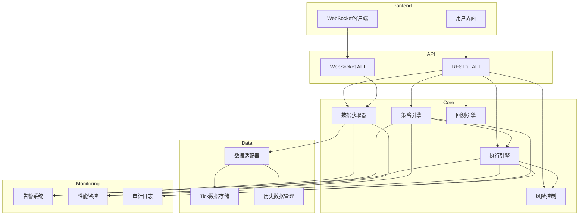

# QuantVision 量化交易系统文档

## 1. 系统架构

### 1.1 架构概述

QuantVision 是一个功能强大的量化交易系统，采用分层架构设计，包括：

- **前端层**：基于现代Web技术的用户界面
- **API层**：FastAPI实现的RESTful API和WebSocket接口
- **核心层**：包含数据获取、策略执行、回测引擎等核心功能
- **数据层**：统一数据适配器和多数据源集成
- **监控层**：实时监控、告警系统和性能分析

### 1.2 组件交互



## 2. 核心功能

### 2.1 数据获取

- **多数据源集成**：支持国内主流金融数据源
- **实时数据流**：WebSocket实时行情推送
- **历史数据管理**：高效存储和检索历史数据
- **数据质量监控**：实时监控数据延迟和质量

### 2.2 策略引擎

- **多策略支持**：技术指标、基本面、机器学习等
- **策略组合**：支持多策略并行运行和资金分配
- **参数优化**：网格搜索和步进优化
- **回测系统**：事件驱动回测引擎

### 2.3 执行系统

- **智能订单路由**：最优执行路径选择
- **算法交易**：TWAP、VWAP、POV等算法
- **多账户管理**：支持多个交易账户
- **模拟交易**：纸张交易和实盘切换

### 2.4 风险管理

- **VaR计算**：风险价值评估
- **止损系统**：多维度止损策略
- **压力测试**：市场冲击模拟
- **风险归因**：风险来源分析

### 2.5 监控系统

- **实时监控**：系统状态和性能指标
- **告警系统**：多渠道告警通知
- **性能分析**：API延迟和数据延迟监控
- **健康检查**：系统健康状态评估

## 3. API 规范

### 3.1 监控相关API

#### 3.1.1 性能监控

| 端点 | 方法 | 描述 | 参数 |
|------|------|------|------|
| `/api/monitor/perf/system` | GET | 获取系统指标 | 无 |
| `/api/monitor/perf/record-api-latency` | POST | 记录API延迟 | endpoint: str, latency_ms: float, status_code: int |
| `/api/monitor/perf/api-latency` | GET | 获取API延迟统计 | 无 |
| `/api/monitor/perf/record-data-latency` | POST | 记录数据延迟 | source: str, symbol: str, latency_ms: float |
| `/api/monitor/perf/record-connection-status` | POST | 记录连接状态 | source: str, status: str, latency_ms: float |
| `/api/monitor/perf/connection-status` | GET | 获取连接状态 | 无 |
| `/api/monitor/perf/health-score` | GET | 获取系统健康得分 | 无 |
| `/api/monitor/perf/metric-series` | GET | 获取指标时间序列 | metric_name: str, limit: int |
| `/api/monitor/perf/dashboard` | GET | 获取完整监控面板 | 无 |
| `/api/monitor/perf/data-latency-heatmap` | GET | 获取数据延迟热力图 | 无 |

#### 3.1.2 告警系统

| 端点 | 方法 | 描述 | 参数 |
|------|------|------|------|
| `/api/monitor/alert/send` | POST | 发送告警 | title: str, message: str, level: str, source: str, channels: list |
| `/api/monitor/alert/list` | GET | 获取告警列表 | level: str, acknowledged: bool, source: str, limit: int |
| `/api/monitor/alert/acknowledge` | POST | 确认告警 | alert_id: str |
| `/api/monitor/alert/stats` | GET | 获取告警统计 | 无 |
| `/api/monitor/alert/configure` | POST | 配置告警通道 | config: dict |

#### 3.1.3 心跳监控

| 端点 | 方法 | 描述 | 参数 |
|------|------|------|------|
| `/api/monitor/heartbeat/register` | POST | 注册策略心跳 | strategy_name: str, interval: int |
| `/api/monitor/heartbeat/report` | POST | 上报心跳 | strategy_name: str |
| `/api/monitor/heartbeat/status` | GET | 获取策略状态 | strategy_name: str |
| `/api/monitor/heartbeat/list` | GET | 获取所有策略状态 | 无 |
| `/api/monitor/heartbeat/stats` | GET | 获取心跳统计 | 无 |

#### 3.1.4 异常检测

| 端点 | 方法 | 描述 | 参数 |
|------|------|------|------|
| `/api/monitor/anomaly/volume` | POST | 检测成交量异常 | symbol: str, volume: float |
| `/api/monitor/anomaly/price` | POST | 检测价格异常 | symbol: str, price: float |
| `/api/monitor/anomaly/stats` | GET | 获取异常统计 | 无 |

#### 3.1.5 审计日志

| 端点 | 方法 | 描述 | 参数 |
|------|------|------|------|
| `/api/monitor/audit/log-signal` | POST | 记录信号事件 | strategy: str, symbol: str, signal_type: str, signal_strength: float |
| `/api/monitor/audit/log-order` | POST | 记录订单事件 | symbol: str, direction: str, quantity: int, price: float |
| `/api/monitor/audit/log-fill` | POST | 记录成交事件 | symbol: str, direction: str, quantity: int, price: float, fee: float |
| `/api/monitor/audit/log-risk` | POST | 记录风控事件 | risk_model: str, approved: bool, details: str |
| `/api/monitor/audit/log-settlement` | POST | 记录结算事件 | symbol: str, pnl: float, pnl_pct: float |
| `/api/monitor/audit/compliance-report` | GET | 获取合规报告 | date: str |
| `/api/monitor/audit/trace/{event_id}` | GET | 追踪事件链 | event_id: str |

## 4. 组件使用指南

### 4.1 日志系统

#### 4.1.1 基本使用

```python
from core.logger import get_logger, log_info, log_error

# 获取日志记录器
logger = get_logger("my_module")

# 记录不同级别的日志
log_info(logger, "信息日志", user="test")
log_error(logger, "错误日志", error=Exception("测试错误"), error_code=123)
```

#### 4.1.2 结构化日志

```python
from core.logger import log_with_context

# 记录带上下文的日志
log_with_context(logger, logging.INFO, "操作日志", 
                user="admin", 
                action="trade", 
                symbol="AAPL", 
                quantity=100)
```

### 4.2 告警系统

#### 4.2.1 基本使用

```python
from core.monitor.alert_system import SmartAlertSystem, AlertLevel, AlertChannel

# 初始化告警系统
alert_system = SmartAlertSystem()

# 发送告警
alert = alert_system.send_alert(
    "交易信号",
    "MACD金叉信号产生",
    AlertLevel.INFO,
    "strategy_engine",
    metadata={"symbol": "AAPL", "signal_strength": 0.8}
)

# 确认告警
alert_system.acknowledge(alert.id)

# 获取告警统计
stats = alert_system.get_stats()
```

#### 4.2.2 配置告警通道

```python
# 配置钉钉告警
alert_system.configure_channels({
    "dingtalk_webhook": "https://oapi.dingtalk.com/robot/send?access_token=your_token"
})

# 配置企业微信告警
alert_system.configure_channels({
    "wechat_webhook": "https://qyapi.weixin.qq.com/cgi-bin/webhook/send?key=your_key"
})

# 发送告警到多个通道
alert = alert_system.send_alert(
    "系统异常",
    "数据库连接失败",
    AlertLevel.CRITICAL,
    "system",
    channels=[AlertChannel.DINGTALK, AlertChannel.WECHAT]
)
```

### 4.3 性能监控面板

#### 4.3.1 基本使用

```python
from core.monitor.perf_dashboard import PerformanceDashboard

# 初始化性能监控面板
dashboard = PerformanceDashboard()

# 记录指标
dashboard.record_api_latency("/api/data", 50.0, 200)
dashboard.record_data_latency("tushare", "AAPL", 100.0)
dashboard.record_connection_status("tushare", "connected", 50.0)
dashboard.record_metric("cpu_usage", 50.0, {"host": "localhost"})

# 获取监控数据
system_metrics = dashboard.get_system_metrics()
api_stats = dashboard.get_api_latency_stats()
connection_status = dashboard.get_connection_status()
health_score = dashboard.get_health_score()
dashboard_data = dashboard.get_dashboard()
```

## 5. 维护程序

### 5.1 日志管理

- **日志轮转**：系统自动进行日志轮转，每个日志文件最大10MB，保留5个备份
- **日志清理**：定期清理超过7天的日志文件
- **日志分析**：使用ELK或类似工具进行日志分析和可视化

### 5.2 监控维护

- **告警规则调整**：根据系统运行情况调整告警阈值和策略
- **监控指标扩展**：根据业务需求添加新的监控指标
- **监控面板更新**：定期更新监控面板，添加新的可视化图表

### 5.3 系统维护

- **依赖更新**：定期更新系统依赖包
- **性能优化**：根据监控数据进行系统性能优化
- **安全更新**：定期更新安全补丁和进行安全审计

## 6. 部署指南

### 6.1 环境要求

- Python 3.8+
- 依赖包：见requirements.txt
- 系统资源：至少4GB内存，50GB磁盘空间

### 6.2 部署步骤

1. **克隆代码库**：`git clone https://github.com/yourusername/quantvision.git`
2. **创建虚拟环境**：`python -m venv venv`
3. **激活虚拟环境**：`source venv/bin/activate`（Linux/Mac）或 `venv\Scripts\activate`（Windows）
4. **安装依赖**：`pip install -r requirements.txt`
5. **启动系统**：`python main.py`

### 6.3 配置项

- **数据源配置**：在`core/data_fetcher.py`中配置数据源API密钥
- **告警通道配置**：在`core/monitor/alert_system.py`中配置告警通道
- **系统参数**：在`core/config.py`中配置系统参数

## 7. 故障排查

### 7.1 常见问题

| 问题 | 可能原因 | 解决方案 |
|------|----------|----------|
| 数据获取失败 | 网络连接问题或API密钥错误 | 检查网络连接和API密钥配置 |
| 策略执行异常 | 策略代码错误或数据格式错误 | 检查策略代码和数据格式 |
| 系统性能下降 | 资源不足或内存泄漏 | 检查系统资源使用情况，重启服务 |
| 告警未触发 | 告警配置错误或阈值设置过高 | 检查告警配置和阈值设置 |

### 7.2 日志分析

- **错误日志**：位于`data/logs/error.log`
- **应用日志**：位于`data/logs/app.log`
- **审计日志**：位于`data/audit/`目录

### 7.3 监控指标

- **系统指标**：CPU、内存、磁盘使用情况
- **API指标**：API响应时间和错误率
- **数据指标**：数据延迟和质量
- **连接指标**：数据源连接状态和延迟

## 8. 安全注意事项

- **API密钥管理**：不要在代码中硬编码API密钥，使用环境变量或配置文件
- **数据加密**：敏感数据传输和存储时使用加密
- **访问控制**：实现基于角色的访问控制
- **审计日志**：记录所有关键操作的审计日志
- **安全更新**：定期更新系统和依赖包，修复安全漏洞

## 9. 性能优化

- **缓存策略**：使用Redis等缓存系统减少重复计算
- **异步处理**：使用异步IO提高并发处理能力
- **数据库优化**：使用索引和批量操作优化数据库性能
- **代码优化**：优化算法和数据结构，减少不必要的计算

## 10. 未来规划

- **机器学习集成**：增强机器学习模型在策略和预测中的应用
- **多市场支持**：扩展支持全球主要金融市场
- **移动应用**：开发移动应用，实现随时随地监控和操作
- **智能推荐**：基于用户行为和市场数据提供智能策略推荐
- **社区功能**：建立策略分享和交流社区

---

**文档版本**：1.0.0
**最后更新**：2024年12月
**维护者**：QuantVision Team
